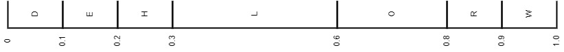
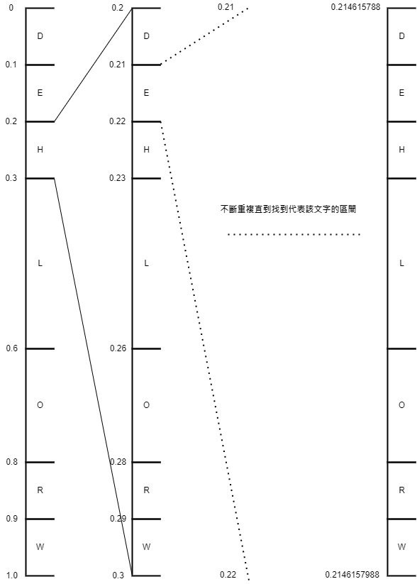

## 算術編碼(Arithmetic coding)簡介
- 是一種無失真資料壓縮的方法，也是熵編碼的一種。
- 算術編碼會直接將整個輸入的訊息編碼為一個小數$x$，使$x$滿足$0 < x < 1.0$。

## 算術編碼-編碼原理
- Input : 任意型態的一段資料。(在此假設為英文大寫字串)
- Output : 在區間$[LOW,HIGH)$中的任意一個小數以二進制形式表示。(在此output為十進制小數)
- 步驟 : 
    1. 計算input中的所有字元出現的次數與機率。
    2. 設置初始區間$[LOW,HIGH) = [0,1)$。利用第一步得到的各字元的機率將區間劃分。以英文大寫字串"HELLOWORLD"舉例，各字元出現的次數與機率如下:

        |　　char　　|　　freq　　|　　prob　　|        
        :--------------:|:---------:|:-----------:
        D             |1          |0.1
        E             |1          |0.1
        H             |1          |0.1
        L             |3          |0.3
        O             |2          |0.2
        R             |1          |0.1
        W             |1          |0.1
    
        各字元將區間$[LOW,HIGH) = [0,1)$劃分成如下的情況。
        
    3. 為了找到一個區間能夠代表該資料，必須從資料的第一個字元'H'開始搜尋他在區間$[LOW,HIGH) = [0,1)$中的哪個子區間，這裡找到'H'在$[0.2,0.3)$，所以更新數值變成$LOW = 0.2, HIGH = 0.3$，並且將這個區間再依照各字元機率劃分子區間。接下來找資料的第二個字元'E'，他在$[0.2,0.3)$中的哪個子區間，這裡找到'E'在$[0.21,0.22)$，所以更新數值變成$LOW = 0.21, HIGH = 0.22$，並且將這個區間再依照各字元機率劃分子區間...不斷重複上述動作直到找到最後一個字元結束為止，即完成編碼。(下圖為尋找區間的過程)<br><br>

        區間更新依據的數學式如下：<br>

        $LOW = preLOW + (preHIGH - preLOW)*L_n$ <br>
        $HIGH = preLOW + (preHIGH - preLOW)*H_n$ <br>
        >$LOW,HIGH =>當前要被更新的區間$<br>
        >$preLOW,preHIGH => 前一次找到的區間$<br>
        >$L_n,H_n => 當前要搜尋的字元在[0,1)之間的哪個子區間$
        
        

## 算術編碼-解碼原理
- Input : 一個十進制小數。
- Output : 印出一段英文大寫字串。
- 步驟 : 如同編碼的步驟一樣，不斷的找input位於哪個區間，直到所有的字元被印出來。


---

## 環境
- OS : Windows10
- IDE : Visual Studio Code
- Compiler : The GNU C++ Compiler(mingw32-gcc-g++-bin , version:9.2.0-2)

---


## 程式碼
```
/*
A simple demo of Arithmetic coding.
The code below can get a output 
which is encoded with the information about 
26 captital character.

Input is any capital sentences, and the output
is a floating-point number.
*/

#include <stdio.h>
#include <stdlib.h>

//#define _DEBUG_
#define STR_LEN 10
#define CAP_char 26
#define A_ASCII_CODE 65

struct prob_interval_node{
    double L;
    double H;
}typedef prob_interval_node;

void get_str_prob(char input_string[], char char_freq[], double prob[]);
void get_prob_interval(char input_string[],double prob[], prob_interval_node prob_interval[]);
double arithmetic_encode(char input_string[], double prob[], prob_interval_node prob_interval[]);
void arithmetic_decode(double code, prob_interval_node prob_interval[]);

int main(){
    char test_input_string[STR_LEN] = {'H','E','L','L','O','W','O','R','L','D'};
    char char_freq[CAP_char] = {0};
    double prob[CAP_char] = {0};
    prob_interval_node prob_interval[CAP_char];
    double code; /*Store the code encoded with 
    the information about the test string*/
    
    get_str_prob(test_input_string,char_freq,prob);
    get_prob_interval(test_input_string,prob,prob_interval);
    code = arithmetic_encode(test_input_string,prob,prob_interval);
    arithmetic_decode(code,prob_interval);
}

void get_str_prob(char input_string[], char char_freq[], double prob[]){
    /*Count the times and probability of a character appearing in a string*/
    for(int i = 0, pos = 0 ; i < STR_LEN ; i ++){
        pos = input_string[i] - A_ASCII_CODE;
        char_freq[pos] = char_freq[pos] + 1;
    }
    #ifdef _DEBUG_
    for(int i = 0 ; i < CAP_char ; i++){
        printf("%c freq is %d\n",A_ASCII_CODE + i,char_freq[i]);
    }
    #endif
    for(int i = 0 ; i < CAP_char ; i ++){
        if(char_freq[i] > 0){
            prob[i] = (double)char_freq[i] / STR_LEN;
            #ifdef _DEBUG_
            printf("%f\n",prob[i]);
            #endif
        }
    }
}

void get_prob_interval(char input_string[],double prob[], prob_interval_node prob_interval[]){
    /*Get prob_intervals of each character*/
    for(int i = 0 ; i < CAP_char ; i ++){
        prob_interval[i].L = 0;
        prob_interval[i].H = 0;
    }
    for(int i = 0, pre_index = 0 ; i < CAP_char ; i ++){
        if(prob[i] > 0){
            prob_interval[i].L = prob_interval[pre_index].H;
            prob_interval[i].H = prob_interval[i].L + prob[i];
            pre_index = i;
        }
    }
}

double arithmetic_encode(char input_string[], double prob[], prob_interval_node prob_interval[]){
    /*Encode the input_string and output the code in double type*/
    char ch;
    double LOW = 0, HIGH = 1;
    double pre_LOW = 0, pre_HIGH = 1;
    double code;
    for(int i = 0 ; i < STR_LEN ; i ++){
        ch = input_string[i];
        LOW = pre_LOW + (pre_HIGH - pre_LOW)*prob_interval[ch-A_ASCII_CODE].L;
        HIGH = pre_LOW + (pre_HIGH - pre_LOW)*prob_interval[ch-A_ASCII_CODE].H;
        pre_LOW = LOW;
        pre_HIGH = HIGH;
    }
    code = (LOW + HIGH) / 2;
    return code;
}

void arithmetic_decode(double code, prob_interval_node prob_interval[]){
    /*Decode and output a string*/
    double LOW = 0, HIGH = 1;
    double pre_LOW = 0, pre_HIGH = 1;
    for(int count = 0 ; count < STR_LEN ; count ++){
        for(int i = 0 ; i < CAP_char ; i ++){
            LOW = pre_LOW + (pre_HIGH - pre_LOW)*prob_interval[i].L;
            HIGH = pre_LOW + (pre_HIGH - pre_LOW)*prob_interval[i].H;
            if(LOW <= code && HIGH > code){
                printf("%c",i+A_ASCII_CODE);
                pre_LOW = LOW;
                pre_HIGH = HIGH;
                break;
            }
        }
    }
}
```
---

## 參考資料
1. [CSDN文章：一文帶你看懂算術編碼(C語言)](https://reurl.cc/xOYZg4)
2. [SegmentFault文章：算術編碼原理解析](https://segmentfault.com/a/1190000011561822)
3. [CSDN文章：算術編碼](https://blog.csdn.net/adam_tu/article/details/7696455)
4. [演算法 Term Project - 算術編碼](https://par.cse.nsysu.edu.tw/~homework/algo01/8934609/index.html)
5. [維基百科：算術編碼](https://zh.wikipedia.org/wiki/%E7%AE%97%E6%9C%AF%E7%BC%96%E7%A0%81)
