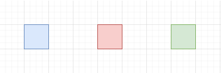

## LZ77編碼(LZ77 coding)簡介
- 是一種無失真資料壓縮的方法。
- 使用字典編碼的方式進行編碼。

## 術語介紹：
在LZ77演算法中有一些術語需要事先知道，如下：


|滑動窗口|前向緩衝區|未讀取資料|
:---:|:---:|:---:
藍色|紅色|綠色

1. 滑動窗口(Sliding Window)：(本文中以藍色代表)
    - 作用：將"前向緩衝區"中的資料拿來與滑動窗口中比對，以此方式編碼，當"前向緩衝區"向前移動時，滑動窗口也要向前移動。
2. 前向緩衝區(Forwarding Buffer)：(本文中以紅色代表)
    - 作用：充當"滑動窗口"前方的緩衝區，"滑動窗口"最多只會移動"前向緩衝區"的長度。
3. 字典：例如$字串 = (AZP)$，可以組合為$字典 = (AZP,AZ)$等。

## LZ77編碼-編碼原理
- Input : 任意型態的一段資料。(在此假設為英文大寫字串)，以下是我所選擇的一些參數。
    - 測試輸入(source)："AZOPZCPOPAZOP"
    - Sliding Window長度：9
    - Forwarding Buffer長度：5
- Output : 一段含有字串與數字的編碼。(在此使用struct定義一個新的資料型態"data_node"，並使用linked list表示輸出)
- 步驟 ： 
    1. 將字串指標的長度設定好，如下(可以任意替換)：
        - Sliding Window : 9個字元，最後一個位置放字串結尾符號'\0'，所以實際放字元的長度只有8個。
        - Forwarding Buffer : 5個字元，最後一個位置放字串結尾符號'\0'，所以實際放字元的長度只有4個。
    2. Forwarding Buffer讀進新的字元直到滿足4個字元
    3. 將Forwarding Buffer中的字串組合出的字典與Sliding Winodw中的字串比對，
        - a. 若字典中某一字串存在於Sliding Window中：<br>
        且該字串長度為$變數x$，位於Sliding Window中索引值$變數y$的位置，且該字串於Forwarding Buffer的後一個字$變數C$，這三個資訊都需要被記錄到一個linked list的node中。
        - b. 若字典中的字串皆不存在於Sliding Window中：<br>
        將Forwarding Buffer中的第一個字元$變數C$記錄進linked list的node中。
    4. 移動Sliding Window與Forwarding Buffer：<br>
        (如果在第3步進a分支，那麼在第4步也是進a分支；若第3步進b分支，那在第4步也是進b分支)
        - a. 將Sliding Window往後移動$x+1$長度，將Forwarding Buffer往後移動$x+1$的長度，並回到第3步，直到Forwarding Buffer往後移動時沒有新的資料進入。
        - b. 將Sliding Window往後移動$1$長度，將Forwarding Buffer往後移動$1$長度，並回到第3步，直到Forwarding Buffer沒有新的資料進入。
    - 編碼過程
    

## 算術編碼-解碼原理
- Input : 一個linked list的head。
- Output : 印出一段英文大寫字串。
- 步驟 : 
    1. 設置Sliding Window長度為8；
    2. 從linked list的第一個node開始解碼：
        - a. 若node中的datatype = 0，印出node中的key，並執行第3步
        - b. 若node中的datatype = 1，印出Sliding Window中對應位置的字串，接著印出node中的key，並執行第3步。
        - c. 若node中的datatype = 2，結束對linked list的traversal，解碼結束。
        到第3步時，照第2步對應的分支進入第3步的分支。(ex: a->a)
    3. 移動Sliding Window：
        - a. 將Sliding Window往後移動一個字元
        - b. 將Sliding Window往後移動(對應長度+1)的字串。
        - c. 不移動。
---

## 環境
- OS : Windows10
- IDE : Visual Studio Code
- Compiler : The GNU C++ Compiler(mingw32-gcc-g++-bin , version:9.2.0-2)

---


## 程式碼
```
/*
Author : XPPGX
date : 2022/04/29

Intro : 
This is a simple demo of LZ77 coding.
The code below can get a output
which is encoded with the information 
about a string.

Input is any sentences constructed
by 26 capital characters, and the
out put is a head of a linked list.
*/

/**********Include lib**********/
#include <stdio.h>
#include <stdlib.h>
#include <string.h>
/*******************************/

/**********Define Lable***********/
#define _RELEASE_
/*********************************/

/**********Define const***********/
#define Sliding_Window_Size 8
#define Forwarding_Buffer_Size 4
#define End_char '\0'
/*********************************/

struct data_node{
    char datatype; // if datatype = '0', data_node store a char; if datatype = '1', data_node store two numbers and one char
    int SW_start;
    int data_len;
    char key;
    data_node *next;
}typedef data_node;

#ifdef _RELEASE_
int str_cmp_loc(char *source, char *target);
void copy_str(char *dest_head, char *src_head, int len);
data_node *node_insert(data_node *rear, char datatype, int SW_start, int data_len, char key);
data_node *LZ77_encode(char *src);
void LZ77_decode(data_node *code);
#endif


int main(){
    //char test_str[] = "ABABCBABABCAD";
    char test_str[] = "AZOPZCPOPAZOP";

    #ifdef _RELEASE_
    data_node *ptr = LZ77_encode(test_str);
    LZ77_decode(ptr);
    #endif
}

#ifdef _RELEASE_
int str_cmp_loc(char *source, char *target){
/*
target : take Forwarding Buffer in
source : take Sliding Window in 
*/
    char *loc = strstr(source, target);
    int location = -1;
    if(loc != NULL){
        location = loc - source;
    }
    else{
        location = -1;
    }
    return location;
}

void copy_str(char *dest_head, char *src_head, int len){
    dest_head = (char*)realloc(dest_head, (len+1)*sizeof(char));
    memcpy(dest_head, src_head, len);
    dest_head[len] = End_char;
}

data_node *node_insert(data_node *rear, char datatype, int SW_start, int data_len, char key){
    rear->datatype = datatype;
    rear->SW_start = SW_start;
    rear->data_len = data_len;
    rear->key = key;
    rear->next = (data_node*)malloc(sizeof(data_node));
    return rear->next;
}

data_node *LZ77_encode(char *src){
    int len = strlen(src);
    int bias = 0;
    int compare_loca = -1;
    char *source = (char*)malloc((len + Sliding_Window_Size + 1) * sizeof(char));
    for(int i = 0 ; i < Sliding_Window_Size ; i ++){
        source[i] = ' ';
    }
    memcpy(source + Sliding_Window_Size, src, len);
    source[len + Sliding_Window_Size] = '\0';

    char *Sliding_Window = (char*)malloc((Sliding_Window_Size + 1)*sizeof(char));
    char *Forwarding_Buffer = (char*)malloc(sizeof(char));
    char *check_str = (char*)malloc(sizeof(char));

    data_node *output = (data_node*)malloc(sizeof(data_node));
    data_node *rear = output;

    while(bias < len){
        memcpy(Sliding_Window, source + bias, Sliding_Window_Size);
        Sliding_Window[Sliding_Window_Size] = End_char;
        copy_str(Forwarding_Buffer, source + Sliding_Window_Size + bias, Forwarding_Buffer_Size);
        compare_loca = -1;
        for(int i = strlen(Forwarding_Buffer) ; i > 1 ; i --){
            copy_str(check_str, Forwarding_Buffer, i);
            compare_loca = str_cmp_loc(Sliding_Window, check_str);
            if(compare_loca != -1){
                rear = node_insert(rear, '1', compare_loca, i, Forwarding_Buffer[i]);
                bias = bias + i + 1;
                break;
            }
        }
        if(compare_loca == -1){
            rear = node_insert(rear, '0', 0, 0, Forwarding_Buffer[0]);
            bias = bias + 1;
        }
    }
    rear->datatype = '2'; //indicate the end of the linked list
    return output;
}

void LZ77_decode(data_node *code){
    //not yet done decode part.
    data_node *ptr;
    int len = 0;
    int bias = 0;
    char *Sliding_Window = (char*)malloc((Sliding_Window_Size + 1)*sizeof(char));
    Sliding_Window[Sliding_Window_Size] = End_char;
    char *source = (char*)malloc(sizeof(char));

    for(ptr = code ; ptr->datatype != '2' ; ptr = ptr->next){//get the whole data length
        switch(ptr->datatype){
            case '0':
                len = len + 1;
                break;
            case '1':
                len = len + ptr->data_len + 1;
                break;
        }
    }
    source = (char*)realloc(source, (Sliding_Window_Size + len + 1)*sizeof(char));
    source[Sliding_Window_Size + len] = End_char;
    for(int i = 0 ; i < Sliding_Window_Size + len ; i ++){
        source[i] = ' ';
    }

    for(ptr = code ; ptr->datatype != '2'; ptr = ptr->next){
        memcpy(Sliding_Window, source + bias, Sliding_Window_Size);
        switch(ptr->datatype){
            case '0':
                source[Sliding_Window_Size + bias] = ptr->key;
                bias = bias + 1;
                break;
            case '1':
                for(int j = ptr->SW_start ; j < (ptr->SW_start + ptr->data_len) ; j ++){
                    source[Sliding_Window_Size + bias] = Sliding_Window[j];
                    bias = bias + 1;
                }
                source[Sliding_Window_Size + bias] = ptr->key;
                bias = bias + 1;
                break;
        }
    }
    printf("%s\n",source + Sliding_Window_Size);
}
#endif

```
---

## 參考資料
1. [維基百科：LZ77與LZ78](https://zh.wikipedia.org/wiki/LZ77%E4%B8%8ELZ78)
2. [ITREAD01文章：LZ77 壓縮算法編碼原理詳解(結合圖片和簡單代碼)](https://www.itread01.com/articles/1475239955.html)
3. [CSDN文章：LZ77算法压缩和解压缩](https://reurl.cc/anN3pX)
4. [51CTO博客：图解 LZ77 压缩算法](https://blog.51cto.com/u_15127629/2873305)
