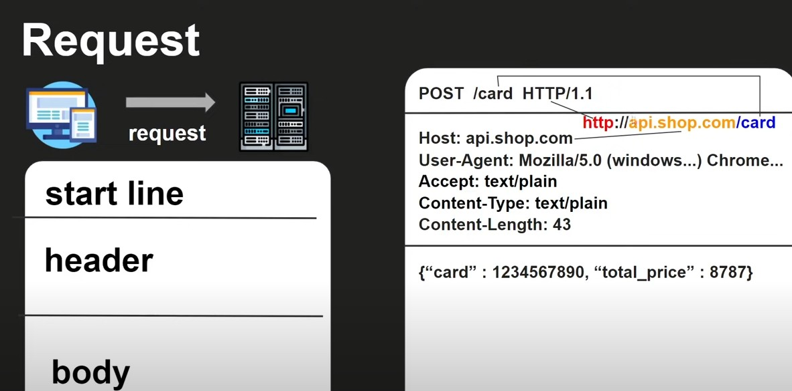

## 環境
- OS : Windows10
- IDE : Arduino 1.8.19
- 開發板 : Linkit 7697

## Write a Channel Feed
### GET method
>先連上WIFI後，創建好client，使用client連線到ThingSpeak，使用GET方法如下
```
#include <LWiFi.h>

#define HOST "api.thingspeak.com" //目標連線網域
#define PORT 80 //目標網域之連接埠

String GET = "GET /update.json?api_key=<your write api_key>"; 

/* Parameter Explain
<your write api_key> : 用你channel的Write API_KEY替代，例如：IIG6242DO0F99R24*/

WiFiClient client;

int data = 1;/*test data*/

void setup(){
	/*在WIFI連線完成之後，執行client物件的HTTP連線並送出request，參考HTTPrequest格式如下圖*/
	if(client.connect(HOST,PORT)){
      Serial.println("connected to server (GET)");
      String str = GET + "&field1=" + String(data);
      client.println(str);
      client.println("Host: api.thingspeak.com");
      client.println("Connection: close\r\n\r\n");
      delay(1000);
	}
	while (client.available()) { //client.read()一次只回傳一個ASCII碼
	    char c = client.read();
	    Serial.write(c);
	}
}
```
## Read a Channel Feed
### GET method
>先連上WIFI後，創建好client，使用client連線到ThingSpeak，使用GET方法如下
```
#include <LWiFi.h>

#define HOST "api.thingspeak.com"
#define PORT 80
String GET = "GET /channels/<your channel id>/fields/<the ordinal of fields>.json?api_key=<your read api_key>&results=<number of results>";
/* Parameter Explain
<your channel id> : 用你的channel id替代，例如：1523954
<the ordinal of fields> : 在你channel中的第幾個field，可用下述替換:1   or   2   or   3等等
<your read api_key> : 用你channel的Read API_KEY替代，例如：L7KGJW416Y8XZ8H8
<number of results> : 藉由設定此參數來調整欲讀取的資料數，例如：填入1，代表從尾端讀取一筆；填入2，代表從尾端讀取兩筆。*/


String returnStr;

void setup(){
	/*在WIFI連線完成之後，執行client物件的HTTP連線並送出request，參考HTTPrequest格式如封面圖*/
	if (client.connect(HOST, PORT)) {
    Serial.println("connected to server (GET)");
    String str = GET;
    client.println(str);
    client.println("Host: api.thingspeak.com");
    client.println("Connection: close\r\n\r\n");
    delay(1000);
  }
  while (client.available()) { //client.read()一次只回傳一個ASCII碼
    int k = client.read();
    returnStr = returnStr + char(k);
  }
  Serial.println(returnStr);
  /*找出"feeds","field1"在字串中的位置，並取出field1對應的value*/
  int val = PTSJ_feeds_field1(returnStr);
  Serial.println(val);
}

int PTSJ_feeds_field1(String str){/*Parse ThingSpeak Json ["feeds"]["field1"]*/
  	int feeds_loca = str.indexOf("feeds",0);
	int field1_loca = str.indexOf("field1",feeds_loca);
	String aim = str.substring(field1_loca+9,field1_loca+10);
	int val = aim.toInt();
	return val;
}
```



# Reference
1. https://www.youtube.com/watch?v=-tRp1IOlKkI
2. https://medium.com/ttyy2985/http%E5%89%8D%E5%BE%8C%E7%AB%AF%E5%82%B3%E8%BC%B8%E6%B5%81%E7%A8%8B-8ee40ffca1bd
3. https://www.arduino.cc/reference/en/language/variables/data-types/stringobject/
4. http://scolin912.blogspot.com/2019/06/linkit7697mcs-reconnect-linkit.html
5. https://byvoid.com/zht/blog/http-keep-alive-header/