## 環境
- OS : Windows10
- IDE : Visual Studio Code
- Other software : CMake、MinGW
---
## 一、安裝必要軟體
### 1. 安裝VScode與MinGW
參考這位作者的文章進行VScode與MinGW安裝=>[用 VSCode 寫 C/C++ 教學](https://hackmd.io/wGohSmNzTHK4WjDYknMYaw?view)，跟著上面那篇文章的教學應該能夠完成以下幾點：
- Visual Studio code安裝完畢
- Visual Studio code中的Extension(在VScode中，透過 **"同時按下ctrl + shift + X"** )，可以看到已經安裝好擴充套件如下：
    - C/C++
    - C++ Intellisense
- MinGW的系統變數已經設置完畢 (設置系統變數是為了在任意目錄底下執行相關命令都可以不用打出詳細路徑)
- MinGW Installer Manager中，已安裝好該勾選的項目如下：
    - Basic Setup : mingw32-gcc-g++-bin (這個是compiler)
    - All Packages -> MinGW -> MinGW Base System : mingw32-gdb-bin (這個是Debugger)

**💡額外要安裝的擴充套件(如下)** <br>
- VScode中還有缺的擴充套件(Extension)要安裝：
    - CMake
    - CMake Tools<br>
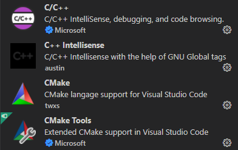
- MinGW Installation Manager還有要勾選進行安裝的(如果發現已安裝就忽略)：
    - All Packages : mingw32-gcc-bin
    - All Packages : mingw32-make-bin (這個是make要用的)

**至此VScode與MinGW軟體與擴充套件的安裝已經完畢**

### 2. 安裝CMake
下載連接：[點我](https://cmake.org/download/)<br>
選擇Windows x64 Installer的cmake-3.23.1-windows-x86_64.msi

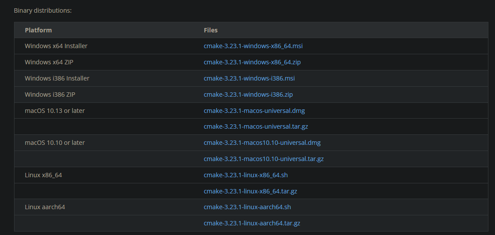

安裝都用預設的設定與路徑。(找到CMake安裝路徑底下的bin目錄我的是C:\Program Files\CMake\bin)<br>
將此路徑加進系統變數的Path中。

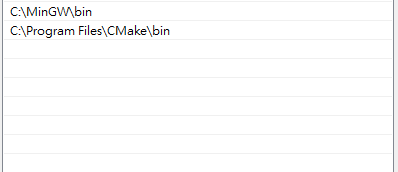
- 測試CMake是否有安裝成功
按下win + R然後輸入cmd按下enter，會出現Terminal，在Terminal中輸入
    ```
    cmake --version
    ```
應該會出現以下畫面
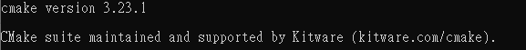

至此CMake已安裝完畢。

---

## 二、創建專案
### 1. 在任意路徑下新增資料夾
此資料夾名稱可以任意設置(這裡將資料夾名稱暫定為VscodeCmakeGccTest)，要注意此資料夾的路徑上不可出現任何中文。<br>
(我的資料夾路徑是C:\Users\Arthur\Desktop\VscodeCmakeGccTest)<br>

### 2. 在VscodeCmakeGccTest中新增資料夾與檔案
對VscodeCmakeGccTest資料夾點選滑鼠右鍵，以code開啟。然後就如下圖中的檔案結構新增資料夾與檔案，檔案內容先空白，下面會提供檔案內容的範例。圖中沒有副檔名的是資料夾，有副檔名的是檔案。依照圖中檔案與資料夾的關係建立檔案，例如：test資料夾中有CMakeLists.txt、main.c(注意有一個資料夾的名子是".vscode"，不能少打那個".")<br>
圖中最外層就是在VscodeCmakeGccTest資料夾底下。

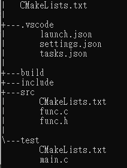

檔案內容：
- VscodeCmakeGccTest/CmakeLists.txt
    ```
    cmake_minimum_required(VERSION 3.0)
    PROJECT(example)

    set(CMAKE_BUILD_TYPE "DEBUG")
    set(CMAKE_CXX_FLAGS_DEBUG "$ENV{CXXFLAGS} -O0 -Wall -g -ggdb")
    set(CMAKE_CXX_FLAGS_RELEASE "$ENV{CXXFLAGS} -O3 -Wall")

    include_directories(.)
    include_directories(${PROJECT_SOURCE_DIR}/src)
    include_directories(${PROJECT_SOURCE_DIR}/include)

    add_subdirectory(src)
    add_subdirectory(test)
    ```
- VscodeCmakeGccTest/src/CMakeLists.txt
    ```
    PROJECT(mytest)

    aux_source_directory(. SRC)

    add_library(mytest ${SRC})
    ```
- VscodeCmakeGccTest/src/func.c
    ```
    #include <stdio.h>

    void func_print(void){
        printf("Hello\n");
    }
    ```
- VscodeCmakeGccTest/src/func.h
    ```
    #ifndef FUNC_H
    #define FUNC_H

    void func_print(void);

    #endif
    ```
- VscodeCmakeGccTest/test/CMakeLists.txt
    ```
    PROJECT(main)

    aux_source_directory(. SRC)

    add_executable(main ${SRC})

    target_link_libraries(main mytest)
    ```
- VscodeCmakeGccTest/test/main.c
    ```
    #include "func.h"

    int main(void){
        func_print();
        int i = 0;
        int f = 1;
        int k = 22;
        int p = 30;
        return 0;
    }
    ```
- VscodeCmakeGccTest/.vscode/launch.json
    ```
    {
        "version" : "0.2.0",
        "configurations": [
            {
                "name" : "gcc.exe",
                "type" : "cppdbg",
                "request": "launch",
                "program": "${workspaceFolder}\\build\\test\\main.exe",
                "args": [],
                "stopAtEntry": false,
                "cwd": "${workspaceFolder}",
                "environment": [],
                "externalConsole": true,
                "MIMode": "gdb",
                "miDebuggerPath": "C:\\MinGW\\bin\\gdb.exe",
                "setupCommands": [
                    {
                        "description": "為 gdb 啟用整齊印出",
                        "text": "-enable-pretty-printing",
                        "ignoreFailures": true
                    }
                ],
                "preLaunchTask": "task of build"
            }
        ]
    }
    ```
- VscodeCmakeGccTest/.vscode/settings.json
    ```
    {
        "C_Cpp.default.configurationProvider": "ms-vscode.cmake-tools",
    }
    ```
- VscodeCmakeGccTest/.vscode/tasks.json
    ```
    {
        "version": "2.0.0",
        "tasks": [/*All jobs are difined like below*/
            {
                "label": "task of cmake",
                "type": "shell",
                "options": {
                    "cwd": "${workspaceRoot}/build"
                },
                "command": "cmake",
                "args": ["..","-G","MinGW Makefiles"]
            },
            {
                "label": "task of make",
                "type": "shell",
                "command": "mingw32-make",

                "options": {
                    "cwd": "${workspaceRoot}/build"
                },
                "dependsOn": ["task of cmake"]
            },
            {
                "label": "task of build",
                "type": "shell",
                "options": {
                    "cwd": "${workspaceRoot}/build"
                },
                "group": {
                    "kind": "build",
                    "isDefault": true
                },
                "dependsOn":["task of make"]
            }
        ]
    }
    ```
---

## 三、Build整個專案並且進行Debug
### 方式一：同時按下(Ctrl + Shift + B)

1. 這個快捷鍵是在進行整個專案的連結與創建，而創建的動作則是根據".vscode/tasks.json"中的內容去執行的。若創建成功，則會在build資料夾中生成一些檔案，並且在路徑"build/test/"底下生成main.exe(等等要Debug必須要有這個main.exe檔案)。Build成功之後資料夾的結構會如下圖所示。

    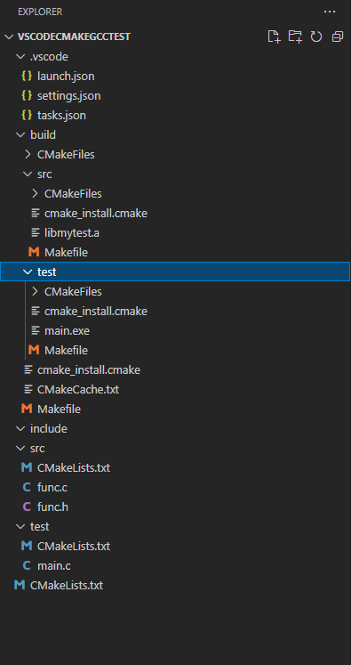

    創建的過程會在VScode的終端輸出一些資訊，如下圖。

    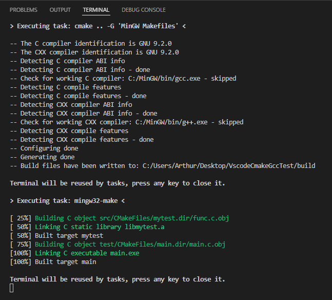

2. 在main.c中設置斷點(breakpoint)
打開main.c並在程式碼第4行設置斷點，設置方式是在欲設置斷點的行數左方用滑鼠左鍵點一下。設置好的樣子如下圖所示。

    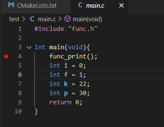

現在按下"左邊列第四個圖示"或是同時按下快捷鍵(Ctrl + Shift + D)，就會到VScode的Debug畫面，如下圖。<br>
    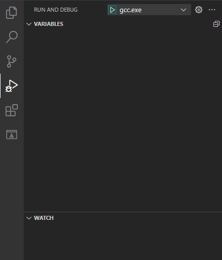
按下那個綠色的三角形，即可進入Debug畫面。如下圖。(黑色的終端畫面可以讓程式碼的輸出印在上面)<br>
    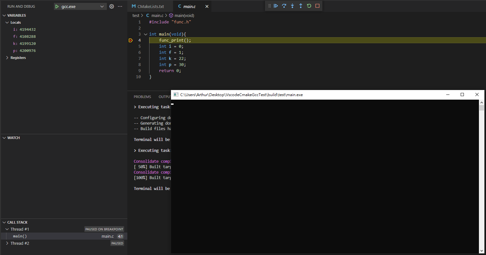
上面那幾個按鈕的功能如下：
　按鈕　|　功能　|
---|:---:|
|執行程式碼至下一個斷點|
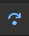|直接執行完本行程式碼，若本行為function也不會進入function中|
|執行本行程式碼，若本行為function則會跳入function中一步一步執行|
|若目前位置在某function中，則會跳出function回到主程式|
|重新執行Debug|
|終止Debug|

現在一次一次的按下第二個按鈕，可以看到黑色終端與左上方區域變數的變化。如下圖。
1. 按下第一次
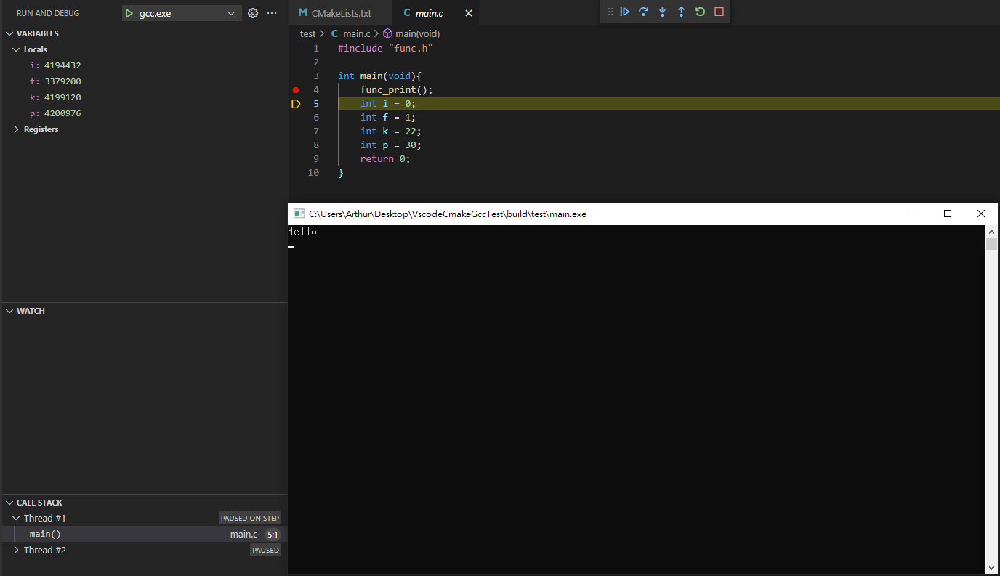
2. 按下第二次

3. 按下第三次
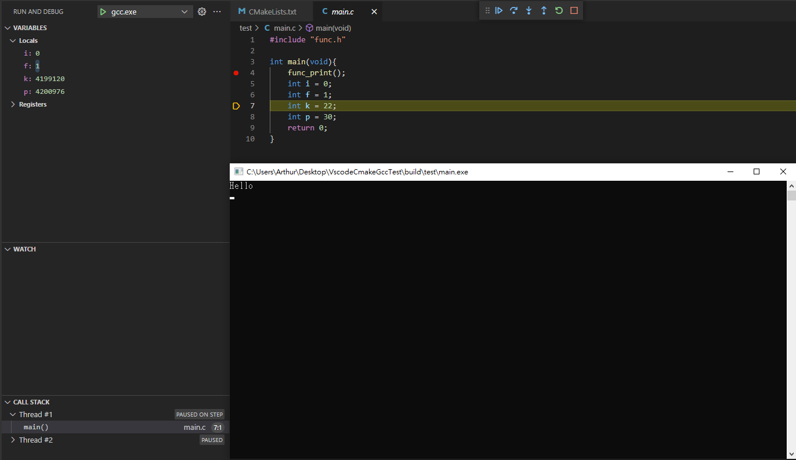

### 方式二：直接到Debug畫面按下綠色三角形
結果也會跟"方式一"一樣，只是他會直接進到Debug畫面，需事先設定好程式的斷點。

---

## 完成
到這裡就完成了Vscode、CMake、MinGW在Win10上的配置與應用，後續若要建立新的專案可以參考此資料夾結構與檔案的關係，並對".vscode/launch.json"與"tasks.json"進行適當修改。
"launch.json" : 設置Debug相關的
"tasks.json" : 寫一些命令在裡面，讓VScode跟著命令進行專案的創建。

## Reference
1. [vscode不写一行配置，用cmake傻瓜式搭建C++编译调试环境](https://zhuanlan.zhihu.com/p/139599430)
2. [VsCode使用CMake与mingw进行开发编译调试](https://www.notion.so/CMake-Make-5afab28b24164350984879d3f5e9c863#74677569df5b4034abaa337678e8f673)
3. [windows cmake没有生成Makefile](https://cloud.tencent.com/developer/article/1784943)
4. [vscode在cmakelist.txt的编译情况下启用debug模式](https://blog.csdn.net/lxn9492878lbl/article/details/91958074)
5. [VS Code + CMake + MinGW 配置C++多文件编译和调试（基于Win10）](https://zhuanlan.zhihu.com/p/74070812)