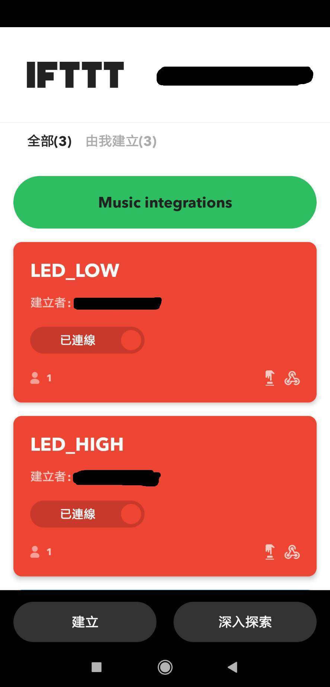

## -keywords-
- Linkit
- ThingSpeak
- MQTT
- IFTTT
- Android

## -Enviroment-
- OS : Windows 10
- IDE : Arduino 1.8.19
- 開發板 : Linkit 7697
- 額外TOOL： Postman
---

### step1 創建一個ThingSpeak Channel
先創好ThingSpeak帳號後，創建一個新channel，只要隨意設定Name欄位即可。<br>
<br>
點選上方標籤的 Channels > My Channels > (自己創的Channel) > API Keys > 可以看到Write API Key 與 Read API Key，且右方有ThingSpeak的API範例。<br>
※可以使用Postman軟體去測試API範例<br>
<br>
Write API之後會用在IFTTT的Applet設定。<br>
### step2 創建ThingSpeak MQTT device
點選上方標籤的 Devices > MQTT > Add a new device > 隨意設定NAME欄位 > 選擇一個剛剛創的Channel > Add Channel  > Add Device > 自己紀錄Client ID、Username、Password 或 Download Credentials 可以選擇Arudino(mqtt_secrets.h)與Plain Text(*.txt)<br>
<br>
※Client ID、Username、Password在Arduino的程式中會用到<br>

### step3 創建IFTTT的applet，並在手機上使用IFTTT的button向ThingSpeak Channel中的Field1傳送1。
在IFTTT創好帳號之後，點選如下<br>
1. Create<br>
<br>
2. If This的Add<br>
<br>
3. 在Search services的搜尋欄，搜尋button並點選button widget<br>
<br>
4. 點選Button press<br>
<br>
5. 點選Then That的Add<br>
<br>
6. 在Search services的搜尋欄，搜尋Webhooks並點選Webhooks<br>
<br>
7. 點選Make a web request<br>
<br>
8. 在URL欄位填入要用到的API，這裡用到ThingSpeak的Write a Channel Feed的API<br>
URL example：https://api.thingspeak.com/update?api_key=X36R5H4OCE82497O&field1=1<br>
api_key後面那串要換成自己Channel的Wrtie API KEY<br>
field1後面可以換成任何整數，這裡設1。<br>
設置好之後按下 Update action > Continue<br>
<br>
9. 任意設定Applet Title，之後會在手機的IFTTT的APP中看到你設定的Title，設定好後按下Finish。<br>
<br>
10. 在Android手機的play商店中，搜尋IFTTT並安裝<br>
<br>
11. 在IFTTT的APP中，把button拉到手機的主畫面，使其可以透過被我們按壓來使用。(這裡我選擇LED_HIGH，因為我在IFTTT創建applet的時候，Applet Title欄位我設定為LED_HIGH)<br>
<br>
12. 按下"新增"按鈕。<br>
<br>
13. 到主畫面的小工具欄去找IFTTT的小工具，並把它拖到主畫面上。<br>
<br>
14. 完成上述後，手機的主畫面應該可以看到這個。<br>
<br>
### step4 開啟Arduino IDE
### 前置作業：
 - 要先設置好Arduino IDE的開發板，可參考這篇文章進行設置：<br>
https://makerpro.cc/2017/06/introducing-linkit7697-development-environment/<br>
- 要添加PubSubClient的library到Arduino IDE，可參考這篇文章進行設置: <br>
https://swf.com.tw/?p=1021<br>

### 程式碼(code)：
```
/*
1. 程式碼中，需要修改與注意的區塊有"Wifi config"與"ThingSpeak MQTT config"區塊，觀察裡面的每個變數並修改成自己的ID或password等。

2. 按Arduino IDE的上傳按鈕，將code傳到Linkit的開發板中運行。

3. 開啟序列埠監控視窗，觀察Linkit接收到的訊息。

※ PubSubClient函式庫的版本為2.6.0
*/
#include <LWiFi.h>
#include <PubSubClient.h>


/*************Wifi config************/
char ssid[] = "your WiFi SSID";
char password[] = "your WiFi Password";
//int status = WL_IDLE_STATUS;
WiFiClient client;
/************************************/

/*******ThingSpeak MQTT config*******/
const char mqttUserName[] = "your mqttUserName";
const char clientID[] = "your clientID";
const char mqttPass[] = "your mqttPassword";
#define channelID YourChannelID //Replace "YourChannelID" by your Channel ID in the ThingSpeak > my channel > click your channel and observe the left top corner of your channel.
const char* server = "mqtt3.thingspeak.com";
#define mqttPort 1883
long lastPublishMillis = 0;
int connectionDelay = 1;
int updateInterval = 15;
char receiveMsg;
int LED_status = 0;
PubSubClient mqttClient(client);
/************************************/

void setup() {
  
  pinMode(LED_BUILTIN,OUTPUT);
  digitalWrite(LED_BUILTIN,LOW);
  
  Serial.begin(9600);
  while(!Serial){
    ;
    }
    
  Serial.print("Attempting to connect to SSID:");
  Serial.println(ssid);
  WiFi.begin(ssid,password);
  Serial.println("Connected to wifi");
  printWifiStatus();
  
  mqttClient.setServer(server,mqttPort);
  mqttClient.setCallback(mqttSubscriptionCallback);
  
}

void loop() {
  
  if(WiFi.status() != WL_CONNECTED){
    Serial.print("Attempting to connect to SSID:");
    Serial.println(ssid);
    WiFi.begin(ssid,password);
    }
  if(!mqttClient.connected()){
    mqttConnect();
    mqttSubscribe(channelID);
    }
  mqttClient.loop();
}

void printWifiStatus() {
    // print the SSID of the network you're attached to:
    Serial.print("SSID: ");
    Serial.println(WiFi.SSID());

    // print your WiFi shield's IP address:
    IPAddress ip = WiFi.localIP();
    Serial.print("IP Address: ");
    Serial.println(ip);

    // print the received signal strength:
    long rssi = WiFi.RSSI();
    Serial.print("signal strength (RSSI):");
    Serial.print(rssi);
    Serial.println(" dBm");
}


// Function to handle messages from MQTT subscription.
void mqttSubscriptionCallback( char* topic, byte* payload, unsigned int length ) {
  // Print the details of the message that was received to the serial monitor.
  Serial.print("Message arrived [");
  Serial.print(topic);
  Serial.print("] ");
  for (int i = 0; i < length; i++) {
    Serial.print((char)payload[i]);
    if( i == length-1){
      receiveMsg = (char)payload[i];
      }
  }
  Serial.println();
  LED_status = (int)receiveMsg - 48; //receiveMsg is ASCII code, change it to normal number.
  
  
  if(LED_status == 1){
    digitalWrite(LED_BUILTIN,HIGH);
    }
  else if(LED_status == 0){
    digitalWrite(LED_BUILTIN,LOW);
    }
}

// Subscribe to ThingSpeak channel for updates.
void mqttSubscribe( long subChannelID ){
  
  String myTopic = "channels/"+String( subChannelID )+"/subscribe/fields/field1";
  mqttClient.subscribe(myTopic.c_str());
}

// Publish messages to a ThingSpeak channel.
/*void mqttPublish(long pubChannelID, String message) {
  String topicString ="channels/" + String( pubChannelID ) + "/publish";
  mqttClient.publish( topicString.c_str(), message.c_str() );
}*/

// Connect to MQTT server.
void mqttConnect() {
  // Loop until connected.
  while ( !mqttClient.connected() )
  {
    // Connect to the MQTT broker.
    if ( mqttClient.connect( clientID, mqttUserName, mqttPass ) ) {
      Serial.print( "MQTT to " );
      Serial.print( server );
      Serial.print (" at port ");
      Serial.print( mqttPort );
      Serial.println( " successful." );
    } else {
      Serial.print( "MQTT connection failed, rc = " );
      // See https://pubsubclient.knolleary.net/api.html#state for the failure code explanation.
      Serial.print( mqttClient.state() );
      Serial.println( " Will try again in a few seconds" );
      delay( connectionDelay*1000 );
    }
  }
}
```
## 成果
程式碼傳進開發板後，開啟手機按下主畫面上的按鈕
- 觀察Arduino IDE的序列埠是否有如下的輸出<br>
<br>
- 觀察LED是否有亮起來<br>

## 討論
- 若讀者要開發新的應用，不只是讓LED燈亮起或熄滅，則應該修改程式碼中的<br>void mqttSubscriptionCallback()副程式，它是MQTT傳回訊息的主要處理程式。必要時可參閱<br>
https://pubsubclient.knolleary.net/api<br>

- 由於這篇文章是使用ThingSpeak免費帳號，故上傳data至Channel的時間被限制在15秒一筆data。相關文章講解：https://community.thingspeak.com/forum/arduino/about-thingspeak-read-and-write-delay-problem/


## Reference
1. https://ithelp.ithome.com.tw/articles/10221790
2. https://www.mathworks.com/help/thingspeak/use-arduino-client-to-publish-to-a-channel.html#d123e3572
3. https://www.mathworks.com/help/thingspeak/mqtt-basics.html#mw_0bf68abc-6c4e-4e2e-8312-e8223a203b71
4. https://www.mathworks.com/help/thingspeak/subscribetoachannelfieldfeed.html
5. https://learningsky.io/mtk-linkit-7697-connect-mosquitto-use-node-red/
6. https://pubsubclient.knolleary.net/api#callback
7. http://www.steves-internet-guide.com/using-arduino-pubsub-mqtt-client/
